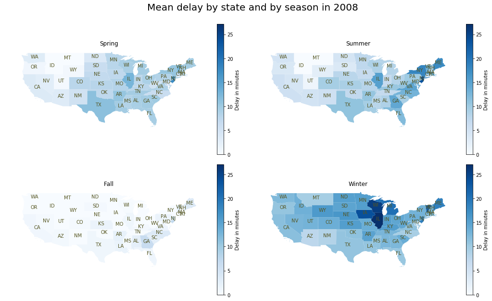

# Passenger Trip Delays in the U.S. Domestic Airline in 2008
## by Benoît Courty

## Investigation Overview

I'd like to better understand what cause flight delay.

## Dataset Overview

I choose to work with US Flight Data from http://stat-computing.org/dataexpo/2009/
    
The data consists of flight arrival and departure details for all commercial flights within the USA, from October 1987 to April 2008. This is a large dataset: there are nearly 120 million records in total.

The data come from the US Bureau of Transportation Statistics.

I choose to focus only on the most recent year : 2008.

The dataset contain one line per flight in the US for 2008. With 29 informations about the fligth : origin, destination, date, reason of delay, take off time... Mainly numerical. Some of them are continuous (delay) and others categorical (month).

It's only the internal US flights (domestic), not the international flight arriving/living the US.

It's already a huge file with seven millions of lines just for 2008 year.

## Main findings

I look at delay from from many other variable, and choose to investigate some of them, where I feel that there could have interesting relationships between them.

I found that you better have not to take off from Newark with Pinnacle Airlines, looking at this plot :

 for Day of week and Departure Time")

I also build geographical vizualisation :

But beware ! This is only statistics and one exceptional event could destroyed my conclusion when looking at narrow combination like Carrier vs Delay vs City.

## List of resources used during the creation of the project.

I start with the Udacity course and build above it with the help of search engine and mainly StackOverFlow.

A blog post from Hugo Larcher inpired me to show some data on a map, something we don't have learn during the course.

You could read it here : https://blog.hugo-larcher.com/flight-data-visualisation-with-pandas-and-matplotlib-ebbd13038647

And https://github.com/bendoesdata/make-a-map-geopandas help me to do it.

I also get inspiration for pie chart rendering from https://medium.com/@kvnamipara/a-better-visualisation-of-pie-charts-by-matplotlib-935b7667d77f

I also look at https://www.flightradar24.com/ to get information on flights.
